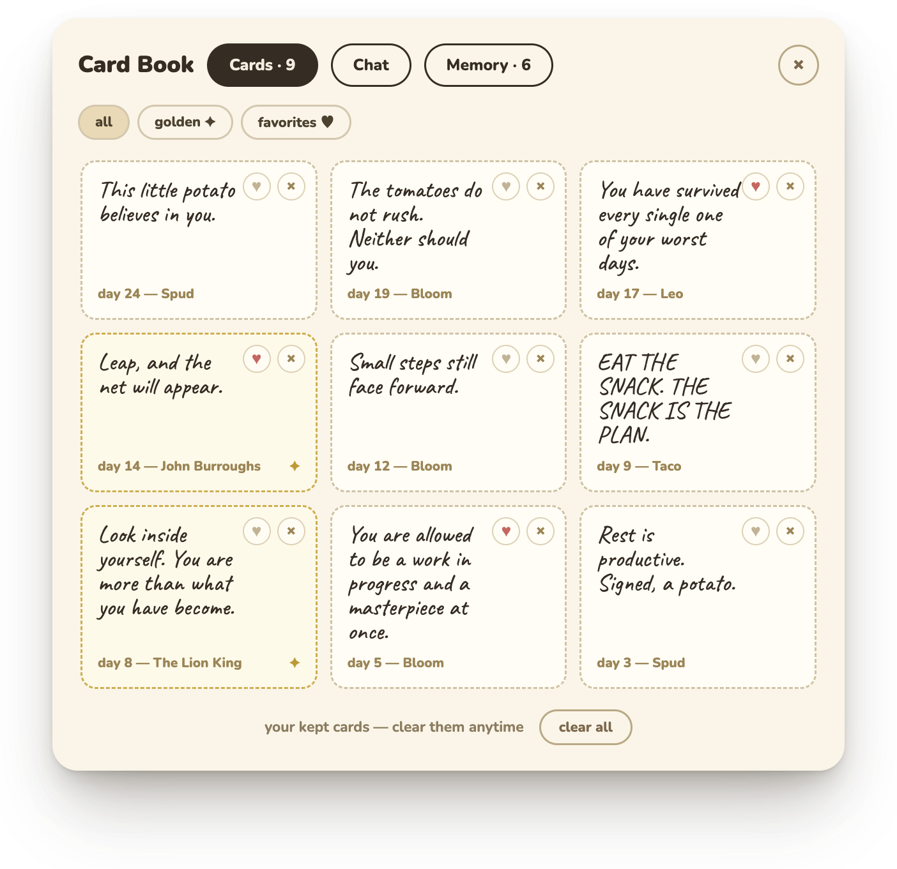
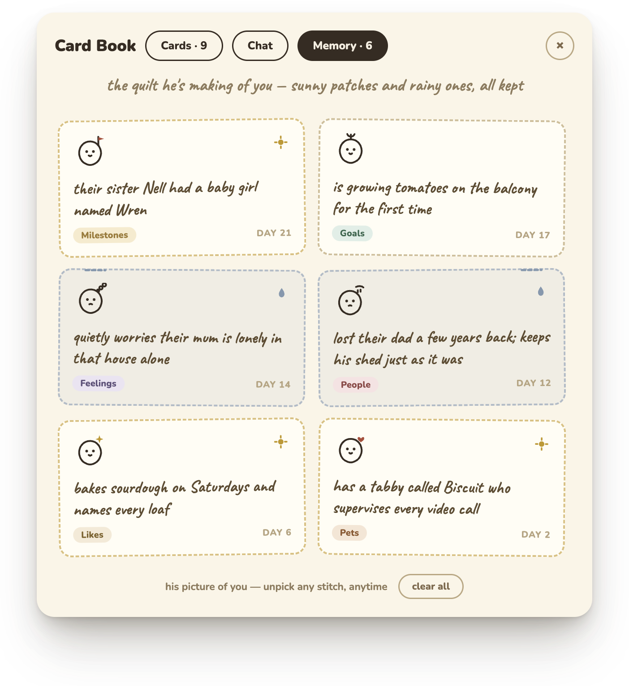

<div align="center">


# Spuddy

**[spud.cherry.surf](https://spud.cherry.surf)** · **[Download for macOS](https://github.com/akumatus/spuddy/releases/latest/download/Spuddy-arm64.dmg)**

**Una papa tejida a crochet a mano que vive en la esquina de tu pantalla — y te entrega una pequeña tarjeta de aliento, una a la vez.**

Es una muñeca de crochet *real*, escaneada en 3D y dada vida en tu escritorio. Sigue tu cursor, murmura para sí mismo, recuerda lo que le cuentas y te teje una tarjeta dorada cuando menos lo esperes.

<br />

      

</div>

<br />

<div align="center">
  
</div>

<br />

> No ocupa una ventana. No te envía notificaciones. Simplemente se sienta en la esquina inferior derecha de tu día, echando un vistazo cuando mueves el mouse, ofreciéndote algo amable.

---

## 🥔 Una tarjeta al día

<div align="center">
  
</div>

Toca la pequeña tarjeta blanca en sus manos y te entregará la frase de hoy: algo cálido, algo irónico, algo que necesitabas escuchar.

- **Toca la tarjeta** para sacar una. ¿Te gustó? **`Keep it ♥`** y se guardará en tu libro.
- Los sorteos son un pequeño gacha ilimitado — *"las buenas no se agotan. toca la tarjeta otra vez, sigue adelante."*
- Cada tarjeta se renderiza **en la tarjeta física que sostiene** — no en un globo de diálogo. La tarjeta es lo fundamental.
- Funciona completamente offline: un conjunto de frases escritas a mano viene incluido en la app, así que nunca quedará sin palabras.

<div align="center">
  
</div>

Todo lo que guardes aterrizará en el **Card Book** (Libro de Tarjetas): fíltralo para ver solo las doradas, o solo las que más te gustaron.

---

## ✨ Puntada Dorada

<div align="center">
  
</div>

De vez en cuando se queda en silencio, se toma su tiempo y **teje una tarjeta dorada a mano**. La mayoría son una famosa cita que ha ido guardando, firmada por quien la dijo por primera vez. Pero una vez que te conoce lo suficiente, de vez en cuando teje una en vivo — basada en lo que realmente han conversado — y esa la firma él mismo. Rara a propósito. Guardada para siempre.

La tarjeta del popup es la misma que te está ofreciendo en la esquina.

---

## 💬 Escucha — y recuerda

<div align="center">
  
</div>

Pasa el mouse sobre él y se deslizará un pequeño cuadro de chat. Cuéntale lo que tienes en mente — *"hoy fue un día intenso"* — y él responderá con su propia voz.

- Responde **en personaje** — impulsado por un LLM en tiempo real, basado en quien tenga turno.
- Cada amigo tiene una voz genuinamente distinta: Spud, arriba, toma tu partido y deja un gancho sencillo para retomar la conversación; el jardinero recibiría el mismo día con *tierra y lluvia*, y el taco con bocadillos y MAYÚSCULAS.
- **Recuerda** — y todo lo que guarda es tuyo para revisarlo o quitarlo en cualquier momento.

<div align="center">
  
</div>

Lo que aprende sobre ti se destila en el **Memory quilt** (colcha de memorias): un parche por cada detalle, los soleados bordados en dorado, los lluviosos en azul. Es todo lo que sabe, en un solo lugar, y cada parche tiene una × para eliminarlo.

---

## 🧵 Conoce al equipo

<div align="center">
  
</div>

Seis pequeñas almas, cada una un tipo distinto de consuelo. Spud viene con la app; los otros cinco no se compran — se **ganan**, a través de cinco tipos diferentes de cuidado: guardar · favoritar · confidar · aparecer · volverse dorado. Una vez amigo, siempre amigo; toca **Set active** para poner a cualquiera en turno.

---

## 🌱 Vive su propia vida

Spuddy no es un protector de pantalla — tiene necesidades y estados de ánimo, y estos cambian con el tiempo (un pequeño motor de personalidad trabaja en segundo plano).

- **¿Aburrido?** Se entretiene solo — persigue su cola, tararea, inclina su tarjeta hacia atrás para releerla, practica su saludo.
- **¿Somnoliento?** Se queda dormido, se irguió de golpe, y un toque lo despertará sobresaltado.
- **¿Extrañándote?** Toca el cristal para llamar tu atención. Responde y se alegrará; ignóralo y simplemente se marchitará un momento y se retirará en silencio — nunca te molestará.
- ¿Te has ido por un tiempo? Te recibirá con un pequeño mensaje de bienvenida.

Murmura todo esto en suaves globos de pensamiento punteados (*"el foco zumba. no me molesta."*) y solo habla en un globo sólido cuando realmente está hablando **contigo**.

Y los pequeños detalles: después de 90 minutos pegado a tu silla, te pedirá que estires. Pasada la 11 pm, te animará a ir a la cama.

---

## 🎬 Cada movimiento está animado a mano

Nada aquí es un clip pregrabado. Cada movimiento se autoriza en un sistema de rigging con curvas de suavizado donde **el origen es siempre el punto de contacto**, **el aplastamiento preserva el volumen** (`sx·sy ≈ 1`), los resortes sobrepasan en una `cubic-bezier(.34, 1.56, .64, 1)`, y cada uno va acompañado de un suave sonido sintetizado. Los largos y autodirigidos — tarareando para sí mismo, quedándose dormido, leyendo su propia tarjeta — son en los que más he sudado.

<!-- 2 across, not 4. GitHub wraps animated GIFs in its own <animated-image>
     player and pins our width= on it as a hard `width`, not a `max-width` — so
     unlike the PNGs above, these four cannot shrink to fit. Four of them need
     4 × (190 + 27) = 869px and the README column on the repo page is only 838
     (the About sidebar takes the rest), so a 4-across row scrolls sideways at
     every window size. Two across needs 434, which survives down to a phone —
     and gives the captions a 419px cell instead of cramming them into 209. -->
<table>
  <tr>
    <td width="50%" align="center"><br /><b>Tarareando</b><br /><sub>se balancea en un compás de 1.32s, la tarjeta marca el ritmo como un metrónomo; ♪ se despista, ojos a medio cerrar y satisfecho</sub></td>
    <td width="50%" align="center"><br /><b>Quedándose dormido</b><br /><sub>respiraciones profundas de 5.8s, párpados al 82%, se inclina y se irguió de golpe — el nudo y la sacudida — con pequeñas <i>Z</i>'s</sub></td>
  </tr>
  <tr>
    <td width="50%" align="center"><br /><b>Leyendo su tarjeta</b><br /><sub>inclina la tarjeta hacia atrás y la lee para sí mismo, los ojos siguen la línea, la cabeza se inclina ±4° acompañándola</sub></td>
    <td width="50%" align="center"><br /><b>Toc toc</b><br /><sub>se inclina 11°, toca el cristal dos veces, grandes ojos esperanzados — así es como dice que te extraña</sub></td>
  </tr>
</table>

<sub>…y una docena más bajo el capó — el gran estirón, persiguiendo su cola, malabarismo con la tarjeta, saludando, celebrando con confeti, ofreciéndote la tarjeta, marchitándose cuando es ignorado, estornudándola torcida, plus tap-squish (golpe-aplastado), eye-roll (poner los ojos en blanco), shy peek (vistazo tímido), hop (salto), pirouette (pirueta), look-around (mirar alrededor), y un lanzamiento horizontal que lo pone a girar y se estabiliza en un resorte subamortiguado.</sub>

---

## 🪡 Qué lo hace especial

Esto no es un sprite. Bajo el capó:

- **Es una muñeca de crochet real.** Cada amigo comenzó como un amigurumi tejido a mano físicamente, fotografiado, **escaneado en 3D con IA** (Rodin), y luego retopologizado en Blender + `gltf-transform` hasta archivos `.glb` PBR de 1-3 MB — fibras de lana reales, puntos reales, iluminados en tiempo real con iluminación basada en imágenes y mapeo de tono Khronos PBR Neutral en **three.js**.
- **El aliento vive en la tarjeta de sus manos** — una textura de canvas en vivo pintada sobre la tarjeta que sostiene la muñeca, no una superposición. La tarjeta es el alma de la papa.
- **Sus ojos y cabeza siguen tu cursor** por toda la pantalla (los ojos lideran, la cabeza sigue); si lo dejas solo, parpadea y mira alrededor por sí mismo.
- **Arrástralo y lánzalo** a cualquier lugar — un lanzamiento horizontal lo hará girar, y se estabilizará con un resorte subamortiguado.
- **Está parcialmente rigged** — garras, ojos y tarjeta independientes, impulsados por un sistema de movimiento con keyframes suavizados, para que pueda saludar, presentar, poner los ojos en blanco y voltear su tarjeta.
- **Se mantiene fuera de tu camino** — una ventana transparente, siempre en primer plano, atravesable con clics, anclada en la esquina. Los clics pasan directamente a lo que haya detrás de él.

---

## 🚀 Ejecútalo desde el código fuente

```bash
cd app
yarn install
yarn start
```

Una pequeña papa aparecerá en la esquina inferior derecha, y una coincidente se ubicará en tu barra de menú (**Show / Hide**, **Language**, **Quit**). ¿Prefieres la app empaquetada? Descarga el [signed DMG](https://github.com/akumatus/spuddy/releases/latest/download/Spuddy-arm64.dmg) de arriba.

---

## 🔑 Usa tu propio cerebro (opcional)

El chat y Puntada Dorada se comunican con un LLM a través de una pequeña **puerta de enlace Cloudflare Worker** (`server/`) — la clave API reside en el servidor como un secreto de Worker y **nunca ingresa a la app ni al repositorio**. La compilación se entrega apuntando a una puerta de enlace alojada; para ejecutar la tuya, despliega el Worker (o ejecútalo localmente) con tu propia clave:

```bash
cd server
cp .dev.vars.example .dev.vars   # add OPENAI_API_KEY=... (or Anthropic / Gemini / DeepSeek)
npm run dev                      # http://localhost:8787
```

Luego apunta la app hacia ella:

```jsonc
// ~/.config/spuddy/config.json
{ "serverUrl": "http://localhost:8787" }
```

La puerta de enlace inicia el chat en **GPT** y los conjuntos de tarjetas de cada día en **Claude**; cualquiera de los dos continúa por la misma cadena (Claude · GPT · Gemini · DeepSeek, omitiendo cualquier backend para el que no hayas proporcionado una clave) cuando uno tiene un mal día, y ambos primarios pueden cambiarse en tiempo de ejecución desde KV sin necesidad de volver a desplegar. Gestiona un presupuesto diario por dispositivo y pregenera los conjuntos de tarjetas de cada día mediante un cron — por lo que una clave compartida puede soportar de forma segura a muchas pequeñas papas. **Sin una puerta de enlace accesible, recurre a frases integradas** — todo sigue funcionando, simplemente no podrá responderte en el momento. Despliegue completo + secretos en [`server/README.md`](server/README.md).

---

## 🧶 Bajo el capó

```
app/                   TypeScript en todo el proyecto (yarn typecheck / yarn build)
├─ electron/src/       proceso principal (empaquetado a electron/*.cjs por esbuild) —
│                      ventana transparente siempre en primer plano · bandeja · cursor global
│                      sondeo · llamadas a la puerta de enlace IA (las claves se quedan en el servidor)
└─ src/
   ├─ main.ts          inicio — construye escena + cerebro, conecta los módulos
   ├─ app/             características — sorteos gacha · chat + memoria · globos de diálogo ·
   │                   paneles Libro/Amigos · toques y arrastres · desbloqueos
   ├─ scene/           three.js — escena · bisagras de rigging de partes · iluminación PBR + IBL ·
   │                   movimientos con keyframes suavizados · la textura de tarjeta en vivo
   ├─ ui/              marcado del popup — superposición · tarjetas · libro · amigos · efectos
   ├─ brain.ts         el motor de personalidad — necesidades, estados de ánimo, comportamiento autónomo
   ├─ content.ts       cada frase, personaje y regla de desbloqueo
   └─ types.ts · store.ts · sfx.ts · remote.ts
server/                puerta de enlace Cloudflare Worker opcional ( bóveda de claves · presupuesto · cron),
                       también TypeScript (src/worker.ts · generate.ts · providers.ts)
```

El pipeline 3D (muñeca real → escaneo → Blender + `gltf-transform` → Draco/WEBP `.glb`) y la calibración del plano de tarjeta por personaje están documentados en [`app/README.md`](app/README.md).

---

## 📜 Licencia

Spuddy tiene una **licencia dividida**, a propósito:

- **El código es abierto.** El fuente bajo `app/` y `server/` es **MIT** — hazle fork, aprende de él, construye tu propia cosa con él. Consulta [`LICENSE`](LICENSE).
- **Mi trabajo en Spuddy no lo es.** Las partes que realmente hice — el modelado y rigging 3D, las animaciones a mano, los renders, las frases escritas y la app y nombre *Spuddy* — están reservados todos los derechos. Por favor, no los copies. Consulta [`ASSETS-LICENSE.md`](ASSETS-LICENSE.md).
- **Las muñecas no son mías para dárlas.** Cada amigo se basa en una muñeca de crochet hecha a mano originalmente por otra persona — no reclamo esos diseños subyacentes, y tú tampoco deberías.

En resumen: **toma el motor y aprende de él — solo no copies mis modelos, animaciones o textos.** 🥔

---

<div align="center">
<br />

<br /><br />
<sub><i>“Descansar es productivo. Firmado, una papa.”</i></sub>
<br /><br />
<sub>Hecho con lana, three.js y mucho ánimo.</sub>
</div>
