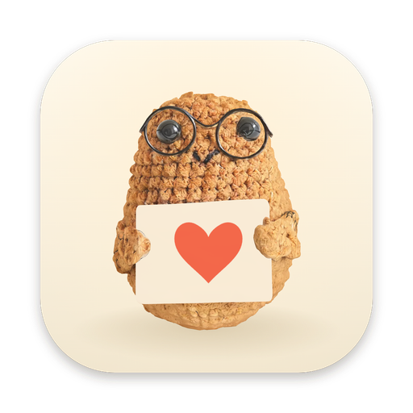
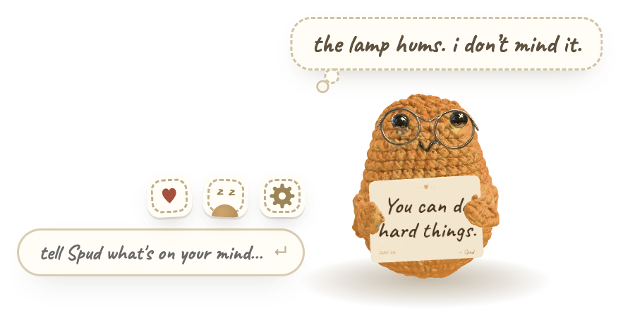
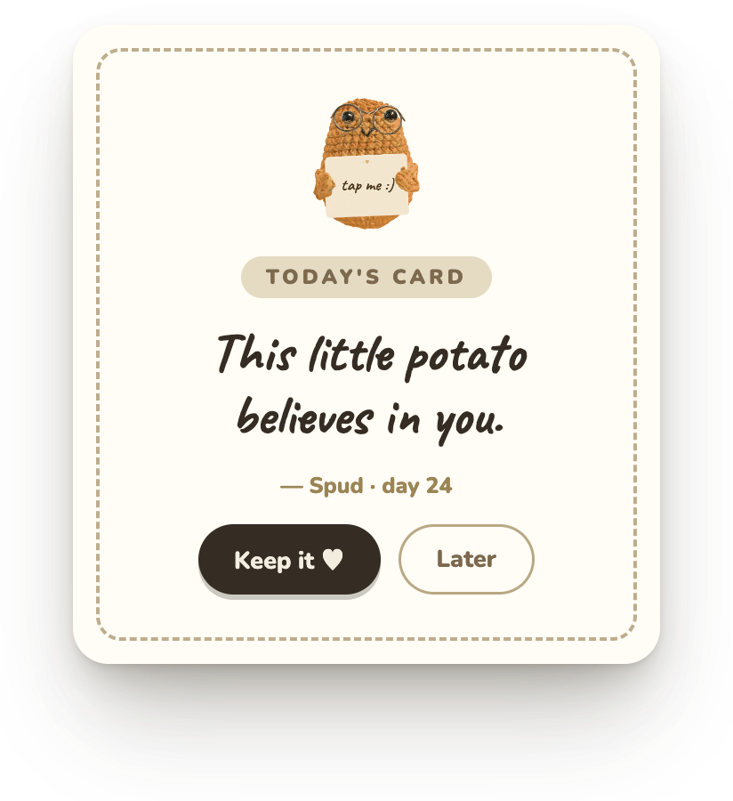
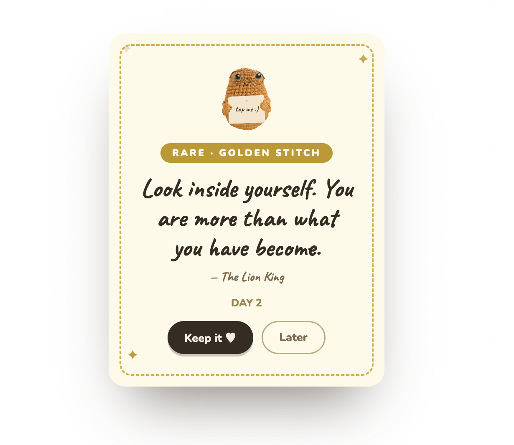
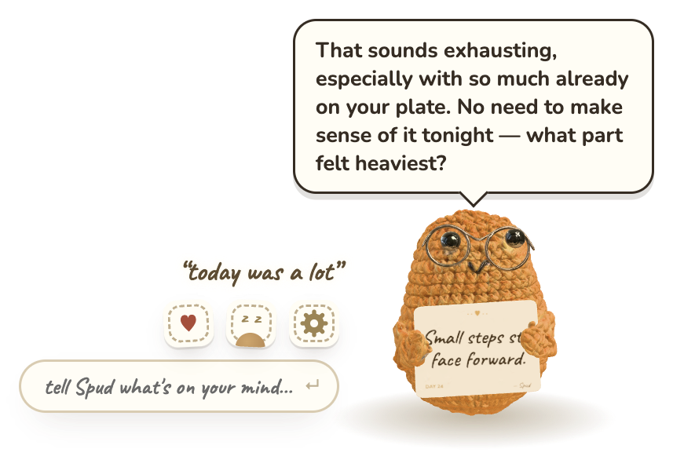
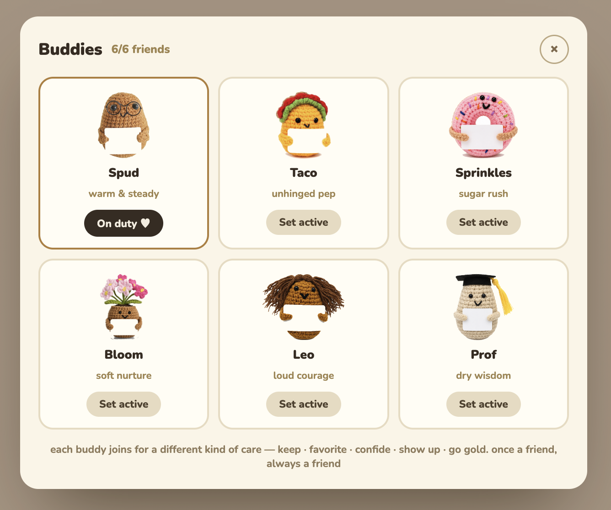
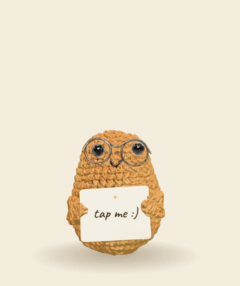
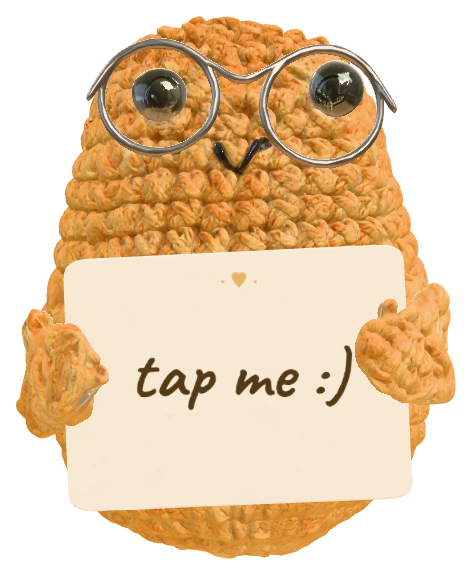

<div align="center">



# Spuddy

**A hand-crocheted potato who lives in the corner of your screen — and hands you a little card of encouragement, one day at a time.**

He's a *real* crocheted doll, 3D-scanned and brought to life on your desktop. He follows your cursor, mutters to himself, remembers what you tell him, and knits you a golden card when you least expect it.

<br />


</div>

<br />

<div align="center">
  
</div>

<br />

> He doesn't take up a window. He doesn't ping you. He just sits in the bottom-right corner of your day, glancing over when you move your mouse, holding out something kind.

---

## 🥔 A card a day

<div align="center">
  
</div>

Tap the little white card in his hands and he hands you today's line — something warm, something dry, something you needed to hear.

- **Tap the card** to draw. Like it? **`Keep it ♥`** and it goes into your book.
- Draws are an unlimited little gacha — *"the good ones don't run out. tap the card again, go on."*
- Every card renders **on the physical card in his hands** — not a speech bubble. The card is the whole point.
- Works fully offline: a hand-written pool ships in the app, so he's never speechless.

---

## ✨ Golden Stitch



Every so often he goes quiet, takes his time, and **knits a golden card by hand** — woven live by AI from the things you've actually talked about, and signed by whoever's on duty.

The card in the popup is the same one he's holding out to you in the corner. Rare on purpose. Kept forever.

---

## 💬 He listens — and he remembers

<div align="center">
  
</div>

Hover over him and a little chat box slides out. Tell him what's on your mind.

- He replies **in character** — powered by a live LLM, grounded in whoever's currently on duty.
- He **remembers**. Everything you share lives in a Memory tab you fully control (delete anything, anytime).
- Each buddy has a genuinely different voice: the gardener above answers a hard day with *soil and rain*; the taco would answer it with snacks and all-caps.

---

## 🧵 Meet the crew

<div align="center">
  
</div>

Six little souls, each a different kind of comfort. You don't buy them — you **earn** them, through six different kinds of care. Once a friend, always a friend; tap **Set active** to put anyone on duty.

---

## 🌱 He lives his own life

Spuddy isn't a screensaver — he has needs and moods, and they drift over time (a small personality engine ticks in the background).

- **Bored?** He entertains himself — chases his tail, hums, flips his card over to re-read it, practices his wave.
- **Sleepy?** He nods off, jerks upright, and a poke startles him awake.
- **Missing you?** He taps the glass to get your attention. Respond and he cheers; ignore him and he just wilts for a moment and quietly backs off — he'll never nag.
- Been away a while? He gives you a little welcome-back.

He mutters through it all in soft dashed thought-bubbles (*"the lamp hums. i don't mind it."*) and only speaks in a solid bubble when he's actually talking **to you**.

And the small stuff: 90 minutes glued to your chair and he'll ask you to stretch. Past 11pm and he'll nudge you toward bed.

---

## 🎬 Every motion is hand-keyed

Nothing here is a canned clip. Every movement is authored on an eased-curve rig where **the origin is always the contact point**, **squash preserves volume** (`sx·sy ≈ 1`), springs overshoot on a `cubic-bezier(.34, 1.56, .64, 1)`, and each one is paired with a soft synth blip. The long, self-directed ones — humming to himself, dozing off, reading his own card — are the ones I sweated the most.

<table>
  <tr>
    <td width="25%" align="center"><br /><b>Humming</b><br /><sub>sways on a 1.32s beat, the card keeping time like a metronome; ♪ drift off, eyes half-lidded and content</sub></td>
    <td width="25%" align="center"><br /><b>Dozing off</b><br /><sub>deep 5.8s breaths, lids at 82%, nods down and jerks upright — the nod-and-catch — with little <i>Z</i>'s</sub></td>
    <td width="25%" align="center"><br /><b>Reading his card</b><br /><sub>tips the card back and reads it to himself, eyes tracking the line, head tilting ±4° along</sub></td>
    <td width="25%" align="center"><br /><b>Big stretch</b><br /><sub>arms up and over, body lengthens 14% and leans back 7°, eyes squeezed shut</sub></td>
  </tr>
  <tr>
    <td width="25%" align="center"><br /><b>Chasing his tail</b><br /><sub>four sharp turns (eyes lead by half a beat), then a frustrated 360° spin, settling like a roly-poly</sub></td>
    <td width="25%" align="center"><br /><b>Juggling the card</b><br /><sub>tosses and catches the card twice, eyes tracking it up and down, body bobbing along</sub></td>
    <td width="25%" align="center"><br /><b>Wave</b><br /><sub>shoulder-hinged hello, three swings on an <code>outBack</code> spring, a little side-lean and a blink</sub></td>
    <td width="25%" align="center"><br /><b>Cheering</b><br /><sub>two hops, paws thrown up and waving, elastic landing · confetti + a little chime</sub></td>
  </tr>
  <tr>
    <td width="25%" align="center"><br /><b>Here, for you</b><br /><sub>eases the card out toward you and tips it to the camera with a proud ±2.5° wiggle</sub></td>
    <td width="25%" align="center"><br /><b>Knock knock</b><br /><sub>leans in 11°, taps the glass twice, big hopeful eyes — this is how he says he misses you</sub></td>
    <td width="25%" align="center"><br /><b>Wilting</b><br /><sub>everything droops — head, paws, eyelids, even the card — a slow sad ease when he's ignored</sub></td>
    <td width="25%" align="center"><br /><b>Sneeze</b><br /><sub>winds back, "—choo!", head snaps 16° with a squash, and the card flies askew</sub></td>
  </tr>
</table>

<sub>…and still more under the hood — tap-squish, eye-roll, shy peek, hop, pirouette, look-around, and a horizontal fling that sets him spinning and settles on an underdamped spring.</sub>

---

## 🪡 What makes it special

This isn't a sprite. Under the hood:

- **It's a real crocheted doll.** Every buddy started as a physical hand-crocheted amigurumi, photographed, **AI-3D-scanned** (Rodin), then retopologized in Blender + `gltf-transform` down to ~0.5 MB PBR `.glb` files — real yarn fibers, real stitches, lit in real time with image-based lighting and ACES tone mapping in **three.js**.
- **The encouragement lives on the card in his hands** — a live canvas texture painted onto the doll's own held card, not an overlay. The card is the soul of the potato.
- **His eyes and head follow your cursor** across the whole screen (eyes lead, head trails); left alone, he blinks and glances around on his own.
- **Grab him and fling him** anywhere — a horizontal throw sets him spinning, and he settles back with an underdamped spring.
- **He's part-rigged** — independent claws, eyes, and card, driven by an eased-keyframe motion system, so he can wave, present, roll his eyes, and flip his card.
- **He stays out of your way** — a transparent, always-on-top, click-through window docked in the corner. Clicks pass straight through to whatever's behind him.

---

## 🚀 Run it

```bash
cd app
npm install
npm start
```

A little potato appears in the bottom-right corner, and a matching one lands in your menu bar (**Show / Hide**, **Quit**).

---

## 🔑 Bring your own brain (optional)

Chat and Golden Stitch talk to an LLM through a tiny **Cloudflare Worker gateway** (`server/`) — the API key lives server-side as a Worker secret and **never enters the app or the repo**. The build ships pointing at a hosted gateway; to run your own, deploy the Worker (or run it locally) with your own key:

```bash
cd server
cp .dev.vars.example .dev.vars   # add DEEPSEEK_API_KEY=...
npm run dev                      # http://localhost:8787
```

Then point the app at it:

```jsonc
// ~/.config/spuddy/config.json
{ "serverUrl": "http://localhost:8787" }
```

The gateway geo-routes to a provider (CN → **DeepSeek**), meters a per-device daily budget, and pre-generates each day's card pools on a cron — so one shared key can safely carry a lot of little potatoes. **With no gateway reachable, he falls back to built-in lines** — everything still works, he just can't answer you in the moment. Full deploy + secrets in [`server/README.md`](server/README.md).

---

## 🧶 Under the hood

```
app/
├─ electron/main.cjs   transparent always-on-top window · tray · global cursor
│                      polling · AI gateway calls (keys stay server-side)
└─ src/
   ├─ scene.js         three.js scene — part hinges, PBR + IBL lighting, shadow
   ├─ motions.js       eased-keyframe motion system (part tracks, idle life, fling)
   ├─ brain.js         the personality engine — needs, moods, autonomous behavior
   ├─ cardscreen.js    the live text painted onto the card in his hands
   ├─ content.js       every line, persona, and unlock rule
   └─ ui.js · store.js · sfx.js · remote.js
server/                optional Cloudflare Worker gateway (key vault · budget · cron)
```

The 3D pipeline (real doll → scan → Blender + `gltf-transform` → Draco/WEBP `.glb`) and per-character card-plane calibration are documented in [`app/README.md`](app/README.md).

---

## 📜 License

Spuddy is **split-licensed**, on purpose:

- **The code is open.** The source under `app/` and `server/` is **MIT** — fork it, learn from it, build your own thing with it. See [`LICENSE`](LICENSE).
- **My work on Spuddy isn't.** The parts I actually made — the 3D modeling & rigging, the hand-keyed animations, the renders, the written lines, and the *Spuddy* app & name — are all-rights-reserved. Please don't lift them. See [`ASSETS-LICENSE.md`](ASSETS-LICENSE.md).
- **The dolls aren't mine to give.** Each buddy is based on a hand-crocheted doll originally made by someone else — I don't claim those underlying designs, and neither should you.

In short: **take the engine and learn from it — just don't lift my models, animations, or writing.** 🥔

---

<div align="center">
<br />

<br /><br />
<sub><i>“Rest is productive. Signed, a potato.”</i></sub>
<br /><br />
<sub>Made with yarn, three.js, and a lot of encouragement.</sub>
</div>
